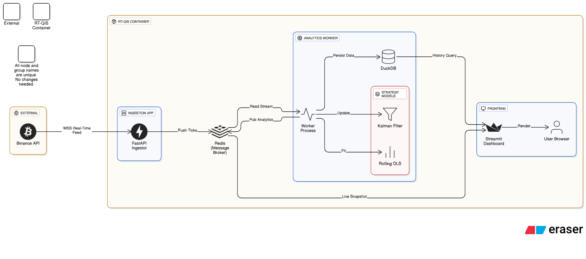

# Architecture Diagram

This document outlines the system architecture.

## Overview Diagram

## Data Flow Description

1.  **Ingestion**: `ingest.py` establishes a persistent WebSocket connection to Binance. It buffers high-velocity messages (Trade/BookTicker) and pushes them to **Redis Stream** (`stream:ticks`) using the `XADD` command.
2.  **Processing**: `worker.py` consumes the `stream:ticks`. It:
    *   Updates the in-memory **Rolling OLS / Kalman** models.
    *   Calculates **Fair Value** and **Z-Score**.
    *   Aggregates ticks into **OHLC Candles**.
    *   Flushes candles to **DuckDB** file (`market_data.duckdb`).
    *   Publishes analytics back to **Redis** (`stream:analytics`).
3.  **Visualization**: `dashboard.py`:
    *   Queries **DuckDB** for the last 6-24 hours of candle history.
    *   Queries **Redis** for the last 10,000 live ticks.
    *   Merges the two datasets.
    *   Displays the real-time chart, latency metrics, and alerts to the User.

